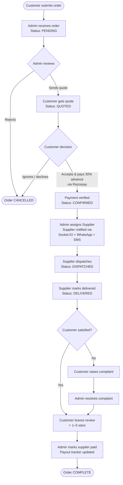
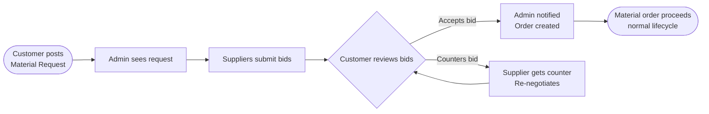
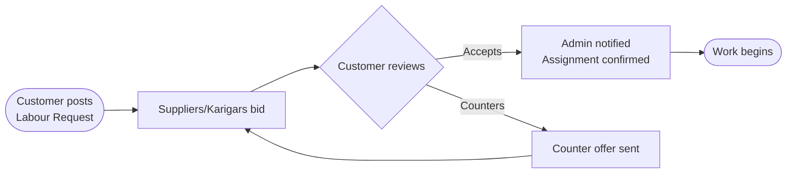
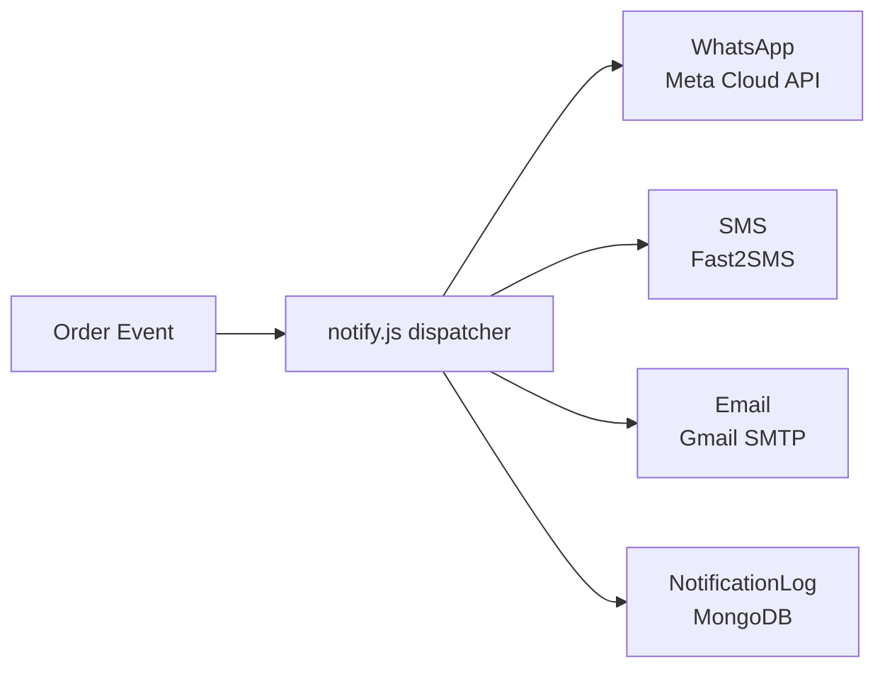

<div align="center">

# 🏗️ Nirman Setu

### Construction Marketplace Platform — India

**Aggregator · Broker · Manager**

> Customer demand lo → Supplier se negotiate karo → Margin rakho → Deliver karwao.

[](https://nodejs.org)
[](https://react.dev)
[](https://mongodb.com)
[](https://tailwindcss.com)
[](/)

</div>

---

## Table of Contents

- [Overview](#overview)
- [Business Model](#business-model)
- [Platform Flow](#platform-flow)
- [Order Lifecycle Flowchart](#order-lifecycle-flowchart)
- [Three Portals](#three-portals)
- [Tech Stack](#tech-stack)
- [Architecture](#architecture)
- [Notification System](#notification-system)
- [Multi-Language Support](#multi-language-support)
- [API Reference](#api-reference)
- [Getting Started](#getting-started)
- [Environment Variables](#environment-variables)
- [Database Schema](#database-schema)
- [Real-time Events](#real-time-events-socketio)
- [Security](#security)
- [Project Pages](#project-pages)

---

## Overview

**Nirman Setu** (निर्माण सेतु — "Construction Bridge") is a full-stack MERN construction aggregator platform built for the Indian market. It connects construction material buyers and labour seekers with verified suppliers through an **admin-managed broker model**.

The platform handles the **complete order lifecycle** — from requirement submission to delivery, payment, dispute resolution, and supplier payout — while keeping both parties on-platform to prevent direct bypass.

```
Three portals. One backend. Zero bypass.
```

| Portal | Access | Role |
|--------|--------|------|
| Customer | `/customer/*` | Place orders, track, pay, chat, review |
| Supplier | `/supplier/*` | Receive assignments, dispatch, update status |
| Admin | `/admin/*` | Broker — quote, assign, collect, manage |

---

## Business Model

```
┌─────────────┐     submits order      ┌─────────────┐
│  CUSTOMER   │ ─────────────────────▶ │    ADMIN    │
│             │                        │  (Broker)   │
│ Pays market │ ◀───────────────────── │             │
│    price    │    sends quote +        │  Keeps the  │
│  (advance)  │    payment link         │   MARGIN    │
└─────────────┘                        └──────┬──────┘
                                              │ assigns at
                                              │ lower price
                                       ┌──────▼──────┐
                                       │  SUPPLIER   │
                                       │             │
                                       │  Dispatches │
                                       │  & Delivers │
                                       └─────────────┘
```

**Revenue Streams:**

| Stream | How |
|--------|-----|
| **Margin** | Customer pays market price; supplier gets lower; admin keeps spread |
| **Platform Fee** | Configurable fee per order (collected upfront) |
| **Labour Commission** | Commission on karigar/labour bookings |
| **Material Quotes** | RFQ-based supplier bidding — admin takes cut |
| **Urgent Surcharge** | Rush delivery premium pricing |

**Anti-Bypass Design:** Customer and supplier never see each other's contact details. All communication flows through the in-app masked chat. WhatsApp/SMS notifications use admin-controlled templates only.

---

## Platform Flow

```
PUBLIC ENTRY
     │
     ├── 🏠 Home Page (landing, categories, CTA)
     │
     ├── 📋 Request Order (21 categories, 150+ items, guest or logged-in)
     │
     └── 🔍 Track Order (guest tracking by Order ID)

CUSTOMER PORTAL
     │
     ├── Register / Login (JWT)
     ├── Dashboard (active orders, stats)
     ├── Orders → Detail → Pay (Razorpay 30% advance)
     ├── Material Quotes (RFQ system — request quotes from suppliers)
     ├── Labour Requests (post karigar requirements)
     ├── Projects (manage construction projects)
     ├── Cost Estimator (calculate material costs)
     ├── Chat with Admin (per-order masked messaging)
     ├── Notifications
     └── Profile

ADMIN PORTAL (Broker)
     │
     ├── Dashboard (revenue KPIs, status grid, complaints alert)
     ├── Orders → Detail → Quote → Assign Supplier → Mark Paid
     ├── Material Quotes (review supplier bids, accept/counter)
     ├── Labour (manage karigar requests & assignments)
     ├── Suppliers (add, KYC, activate/deactivate)
     ├── Customers (view all customers)
     ├── Payouts (track supplier payments)
     ├── Fees (configure platform fees)
     ├── Material Rates (set standard market rates)
     ├── Stock (supplier stock visibility)
     ├── Analytics (revenue, categories, cities, top suppliers)
     ├── Complaints (raise → resolve flow)
     ├── Notifications (real-time bell, 60s polling)
     └── Settings (change password)

SUPPLIER PORTAL
     │
     ├── Register / Login (JWT)
     ├── Dashboard (orders stats, performance, earnings)
     ├── Orders → Detail → Dispatch → Deliver
     ├── Material Quote Requests (bid on RFQs)
     ├── Labour Requests (bid on karigar posts)
     ├── Stock Management (update available stock)
     ├── Earnings (payout history)
     └── Profile (KYC status, availability toggle)
```

---

## Order Lifecycle Flowchart



---

## RFQ / Material Quote Flow



---

## Labour / Karigar Flow



---

## Three Portals

### Customer Portal — Pages

| Page | Route | Description |
|------|-------|-------------|
| Dashboard | `/customer` | Active orders, stats overview |
| Orders | `/customer/orders` | All orders with status filter tabs |
| Order Detail | `/customer/orders/:id` | Track, chat, pay, review, complain |
| Material Quotes | `/customer/quotes` | RFQ — request material quotes |
| Labour | `/customer/labour` | Post karigar requirements |
| Projects | `/customer/projects` | Manage construction projects |
| Project Detail | `/customer/projects/:id` | Per-project tracking |
| Cost Estimator | `/customer/estimator` | Calculate material costs |
| Notifications | `/customer/notifications` | All alerts |
| Profile | `/customer/profile` | Update info, change password |

### Admin Portal — Pages

| Page | Route | Description |
|------|-------|-------------|
| Dashboard | `/admin` | KPI cards, status grid, complaints alert |
| Orders | `/admin/orders` | Full order list — search, filter, CSV export |
| Order Detail | `/admin/orders/:id` | Quote, assign, status, chat, resolve |
| Material Quotes | `/admin/quotes` | Review RFQ bids from suppliers |
| Labour | `/admin/labour` | Karigar request management |
| Suppliers | `/admin/suppliers` | Add, KYC, activate/deactivate |
| Customers | `/admin/customers` | View all customers |
| Analytics | `/admin/analytics` | Revenue, categories, cities, top suppliers |
| Complaints | `/admin/complaints` | All open/resolved complaints |
| Payouts | `/admin/payouts` | Supplier payout tracker |
| Platform Fees | `/admin/fees` | Configure fee per category |
| Material Rates | `/admin/rates` | Standard market rate reference |
| Stock | `/admin/stock` | Supplier stock overview |
| Notifications | `/admin/notifications` | All notifications log |
| Settings | `/admin/settings` | Change admin password |

### Supplier Portal — Pages

| Page | Route | Description |
|------|-------|-------------|
| Dashboard | `/supplier` | Stats, performance, recent orders |
| Orders | `/supplier/orders` | Assigned orders list |
| Order Detail | `/supplier/orders/:id` | Dispatch, deliver, update status |
| Quote Requests | `/supplier/quotes` | Bid on customer RFQs |
| Labour Requests | `/supplier/labour` | Bid on karigar posts |
| Stock | `/supplier/stock` | Manage available stock |
| Earnings | `/supplier/earnings` | Payout history |
| Profile | `/supplier/profile` | KYC status, availability toggle |

---

## Tech Stack

### Backend
| Package | Version | Purpose |
|---------|---------|---------|
| Node.js + Express 5 | `^5.2.1` | REST API server |
| MongoDB + Mongoose 9 | `^9.6.1` | Database + ODM |
| Socket.IO | `^4.8.3` | Real-time events |
| jsonwebtoken | `^9.0.3` | JWT auth (3 roles) |
| bcryptjs | `^3.0.3` | Password hashing |
| Razorpay | `^2.9.6` | Payment gateway |
| Nodemailer | `^8.0.7` | Email (Gmail SMTP) |
| Axios | `^1.9.0` | WhatsApp + SMS API calls |
| Helmet | `^8.1.0` | HTTP security headers |
| express-rate-limit | `^8.4.1` | Rate limiting |
| express-validator | `^7.3.2` | Input validation |
| dotenv | `^17.4.2` | Environment config |

### Frontend
| Package | Version | Purpose |
|---------|---------|---------|
| React 19 + Vite 8 | `^19.2.5` | UI framework + build |
| React Router v7 | `^7.14.2` | Client-side routing |
| Axios | `^1.15.2` | HTTP client |
| Tailwind CSS v4 | `^4.2.4` | Utility-first styling |
| Socket.IO Client | `^4.8.3` | Real-time subscriptions |
| Lucide React | `^1.14.0` | Icon library |
| React Hot Toast | `^2.6.0` | Toast notifications |

---

## Architecture

```
nirman-setu/
├── client/                        # React + Vite frontend
│   └── src/
│       ├── i18n/
│       │   ├── translations.js    # All UI strings (4 languages)
│       │   └── useT.js            # Translation hook
│       ├── context/
│       │   ├── AdminContext.jsx
│       │   ├── CustomerContext.jsx
│       │   ├── SupplierContext.jsx
│       │   └── SocketContext.jsx
│       ├── components/
│       │   ├── AdminLayout.jsx
│       │   ├── CustomerLayout.jsx
│       │   ├── SupplierLayout.jsx
│       │   ├── ChatPanel.jsx
│       │   └── WhatsAppButton.jsx
│       └── pages/
│           ├── admin/             # 15 admin pages
│           ├── customer/          # 10 customer pages
│           ├── supplier/          # 8 supplier pages
│           ├── Home.jsx           # Landing page
│           ├── RequestOrder.jsx   # 21-category order form (public)
│           ├── TrackOrder.jsx     # Guest order tracking
│           ├── Receipt.jsx        # Printable receipt
│           ├── Invoice.jsx        # Invoice page
│           └── Blog.jsx           # Blog / content
│
└── server/                        # Node + Express backend
    ├── config/
    │   └── db.js                  # MongoDB connection
    ├── middleware/
    │   ├── auth.js                # Admin JWT middleware
    │   ├── customerAuth.js        # Customer JWT middleware
    │   └── supplierAuth.js        # Supplier JWT middleware
    ├── models/
    │   ├── Order.js               # Central order model
    │   ├── Customer.js
    │   ├── Supplier.js
    │   ├── Admin.js
    │   ├── Message.js             # In-app chat
    │   ├── QuoteRequest.js        # Material RFQ
    │   ├── Quote.js               # Supplier bids
    │   ├── LabourRequest.js
    │   ├── LabourQuote.js
    │   ├── Project.js
    │   ├── MaterialRate.js
    │   ├── SupplierStock.js
    │   ├── PlatformFee.js
    │   └── NotificationLog.js
    ├── routes/
    │   ├── adminRoutes.js
    │   ├── customerRoutes.js
    │   ├── supplierRoutes.js
    │   ├── orderRoutes.js
    │   ├── quoteRoutes.js
    │   ├── labourRoutes.js
    │   ├── projectRoutes.js
    │   ├── feeRoutes.js
    │   ├── rateRoutes.js
    │   └── stockRoutes.js
    └── utils/
        ├── mailer.js              # Email templates (Nodemailer)
        ├── whatsapp.js            # Meta WhatsApp Cloud API
        ├── sms.js                 # Fast2SMS integration
        └── notify.js              # Unified notification dispatcher
```

**Request flow:**
```
Browser → Vite (proxy /api) → Express API → Mongoose → MongoDB Atlas
                                    ↕
                              Socket.IO (ws://)
                                    ↕
                    Notifications: Email + WhatsApp + SMS
```

---

## Notification System

Every key event triggers **multi-channel notifications** automatically:



| Event | WhatsApp | SMS | Email |
|-------|----------|-----|-------|
| Payment received | ✅ Customer | ✅ Customer | — |
| RFQ bid received | ✅ Customer | ✅ Customer | ✅ Customer |
| RFQ bid accepted | ✅ Supplier | ✅ Supplier | ✅ Supplier |
| RFQ counter offer | ✅ Recipient | ✅ Recipient | — |
| Labour bid received | ✅ Customer | ✅ Customer | ✅ Customer |
| Labour bid accepted | ✅ Supplier | ✅ Supplier | ✅ Supplier |
| Labour counter offer | ✅ Recipient | ✅ Recipient | — |

All notifications are **fire-and-forget** (never crash the main request) and logged to `NotificationLog` collection for admin review.

---

## Multi-Language Support

The platform supports **4 languages** via a custom `useT()` hook (no external library):

| Code | Language |
|------|----------|
| `hinglish` | Hinglish (default) — Hindi words in Roman script |
| `hi` | Hindi (Devanagari) |
| `en` | English |
| `bn` | Bengali |

Language is stored in `localStorage` and applied globally. All UI strings — labels, errors, placeholders, empty states — go through the translation system.

---

## API Reference

### Public Endpoints
| Method | Endpoint | Description |
|--------|----------|-------------|
| `POST` | `/api/orders/request` | Submit new order (10 req/hr rate limit) |
| `GET` | `/api/orders/track/:orderId` | Guest order tracking |
| `GET` | `/api/health` | Server health check |

### Customer (`/api/customer`)
| Method | Endpoint | Auth | Description |
|--------|----------|------|-------------|
| `POST` | `/register` | — | Register |
| `POST` | `/login` | — | Login (rate limited) |
| `GET` | `/me` | ✓ | Get profile |
| `PATCH` | `/profile` | ✓ | Update profile |
| `GET` | `/orders` | ✓ | List my orders |
| `GET` | `/orders/:id` | ✓ | Order detail |
| `PUT` | `/orders/:id/cancel` | ✓ | Cancel (pending only) |
| `POST` | `/orders/:id/review` | ✓ | Submit review |
| `POST` | `/orders/:id/complaint` | ✓ | Raise complaint |
| `GET` | `/orders/:id/messages` | ✓ | Get chat |
| `POST` | `/orders/:id/messages` | ✓ | Send chat |
| `POST` | `/orders/:id/payment/create` | ✓ | Create Razorpay order |
| `POST` | `/orders/:id/payment/verify` | ✓ | Verify payment signature |

### Admin (`/api/admin`)
| Method | Endpoint | Auth | Description |
|--------|----------|------|-------------|
| `POST` | `/login` | — | Admin login |
| `GET` | `/dashboard` | ✓ | KPI stats |
| `GET` | `/analytics` | ✓ | Revenue, categories, cities |
| `GET` | `/notifications` | ✓ | Bell notifications (48h) |
| `GET` | `/orders` | ✓ | List + filter + search |
| `GET` | `/orders/export` | ✓ | CSV export |
| `GET` | `/orders/:id` | ✓ | Order detail |
| `PUT` | `/orders/:id/quote` | ✓ | Send quote |
| `PUT` | `/orders/:id/status` | ✓ | Update status |
| `PUT` | `/orders/:id/assign-supplier` | ✓ | Assign supplier |
| `PUT` | `/orders/:id/payment` | ✓ | Mark paid |
| `PUT` | `/orders/:id/complaint/resolve` | ✓ | Resolve complaint |
| `PATCH` | `/orders/:id/supplier-payout` | ✓ | Mark supplier paid |
| `GET` | `/suppliers` | ✓ | List suppliers |
| `POST` | `/suppliers` | ✓ | Add supplier |
| `GET` | `/suppliers/:id` | ✓ | Supplier detail + stats |
| `PUT` | `/suppliers/:id/kyc` | ✓ | Update KYC |
| `PUT` | `/suppliers/:id/toggle` | ✓ | Activate/deactivate |
| `PUT` | `/suppliers/:id/reset-password` | ✓ | Reset password |
| `GET` | `/customers` | ✓ | List customers |
| `GET` | `/analytics` | ✓ | Analytics data |

### Supplier (`/api/supplier`)
| Method | Endpoint | Auth | Description |
|--------|----------|------|-------------|
| `POST` | `/login` | — | Supplier login |
| `POST` | `/register` | — | Supplier register |
| `GET` | `/me` | ✓ | Get profile |
| `PATCH` | `/profile` | ✓ | Update profile |
| `PUT` | `/availability` | ✓ | Toggle availability |
| `GET` | `/dashboard` | ✓ | Stats + performance |
| `GET` | `/orders` | ✓ | Assigned orders |
| `GET` | `/orders/:id` | ✓ | Order detail |
| `PUT` | `/orders/:id/status` | ✓ | Update dispatch/delivery |

---

## Getting Started

### Prerequisites
- Node.js 18+
- MongoDB Atlas account (or local MongoDB)
- Razorpay account (test keys for dev)
- Gmail with App Password
- Fast2SMS account (SMS notifications)
- Meta Developer account (WhatsApp — optional)

### Installation

```bash
# Clone the repo
git clone https://github.com/akshaycodexx/Nirman-Setu-Construction-Marketplace-Platform.git
cd Nirman-Setu-Construction-Marketplace-Platform

# Install server dependencies
cd server && npm install

# Install client dependencies
cd ../client && npm install
```

### Create Admin Account

```bash
cd server
node scripts/createAdmin.js
```

### Run in Development

```bash
# Terminal 1 — backend (port 5000)
cd server && npm run dev

# Terminal 2 — frontend (port 5173)
cd client && npm run dev
```

Open [http://localhost:5173](http://localhost:5173)

| Route | Description |
|-------|-------------|
| `/` | Home / landing page |
| `/request` | Place a new order |
| `/track` | Track an order (guest) |
| `/customer/login` | Customer login |
| `/admin/login` | Admin login |
| `/supplier/login` | Supplier login |

---

## Environment Variables

Create `server/.env`:

```env
PORT=5000
MONGO_URI=mongodb+srv://<user>:<pass>@cluster.mongodb.net/nirman-setu
CLIENT_URL=http://localhost:5173

JWT_SECRET=your_secret_here

# Gmail SMTP (Google → Security → 2FA ON → App Passwords)
EMAIL_USER=your@gmail.com
EMAIL_PASS=xxxx xxxx xxxx xxxx
ADMIN_EMAIL=admin@gmail.com

# Razorpay (dashboard.razorpay.com → Settings → API Keys)
RAZORPAY_KEY_ID=rzp_test_xxxxxxxxxx
RAZORPAY_KEY_SECRET=your_razorpay_secret

# Fast2SMS (fast2sms.com → Dev API)
FAST2SMS_API_KEY=your_api_key

# Meta WhatsApp Cloud API (optional)
WHATSAPP_PHONE_NUMBER_ID=your_phone_number_id
WHATSAPP_TOKEN=your_access_token

# Support WhatsApp number (without +)
SUPPORT_PHONE=91XXXXXXXXXX
```

---

## Database Schema

### Order (central model)
```js
{
  orderId: String,           // NS-2026-0001 (auto-generated)
  category: String,          // one of 21 categories
  items: [{ name, quantity, unit }],
  delivery: { address, city, pincode, date, slot },
  customer: { name, phone, email },
  customerId: ObjectId,      // ref: Customer (null = guest)
  status: enum[
    pending, quoted, confirmed,
    dispatched, delivered, cancelled
  ],
  quote: { amount, breakdown, sentAt },
  payment: {
    status, advanceAmount, advancePaidAt,
    razorpayOrderId, razorpayPaymentId, signature
  },
  supplierId: ObjectId,      // ref: Supplier
  adminNote, supplierNote,
  review: { rating(1-5), comment, reviewedAt },
  complaint: { text, raisedAt, status, resolution, resolvedAt },
  supplierPayout: { status(pending/paid), amount, paidAt, note },
  timeline: [{ status, note, by, at }],
}
```

### 21 Construction Categories

```
basic_materials    structural         wood_carpentry
chemicals          paint_finishing    flooring_tiling
doors_windows      interior_furniture electrical
plumbing_sanitary  machinery          transport
labour             contractors        design_planning
shuttering         water_utilities    smart_features
complete_services  commercial         support_services
```

---

## Real-time Events (Socket.IO)

### Client → Server
| Event | Payload | Description |
|-------|---------|-------------|
| `join:admin` | — | Admin room (new order alerts) |
| `join:order` | `orderId` | Subscribe to order updates |
| `leave:order` | `orderId` | Unsubscribe |
| `join:supplier` | `supplierId` | Supplier-specific events |

### Server → Client
| Event | Room | Trigger |
|-------|------|---------|
| `order:new` | `admin` | New order submitted |
| `order:updated` | `order:<id>` | Status change |
| `chat:message` | `order:<id>` | New chat message |
| `supplier:new-order` | `supplier:<id>` | Supplier assigned |

---

## Security

| Measure | Implementation |
|---------|---------------|
| Password hashing | bcryptjs (salt: 10) |
| Auth tokens | JWT — role-specific secrets, 7d expiry |
| HTTP headers | Helmet.js (XSS, HSTS, CSP) |
| Rate limiting | Auth: 20 req/15min · Orders: 10 req/hr |
| Input validation | express-validator on all write endpoints |
| Payment verification | Razorpay HMAC-SHA256 signature |
| Anti-bypass | Supplier never sees customer contact — chat only |
| CORS | Restricted to `CLIENT_URL` env |

---

## Project Pages

### Full Page Count

| Portal | Pages |
|--------|-------|
| Public | Home, RequestOrder, TrackOrder, Receipt, Invoice, Blog, Terms, Privacy, 404 |
| Customer | Dashboard, Orders, OrderDetail, Quotes, Labour, Projects, ProjectDetail, Estimator, Notifications, Profile |
| Admin | Dashboard, Orders, OrderDetail, Quotes, Labour, Suppliers, Customers, Analytics, Complaints, Payouts, Fees, Rates, Stock, Notifications, Settings |
| Supplier | Dashboard, Orders, OrderDetail, QuoteRequests, LabourRequests, Stock, Earnings, Profile |
| **Total** | **~42 pages** |

---

## Author

**Akshay Kumar Mandal**

| Platform | Handle |
|----------|--------|
| GitHub | [@akshaycodexx](https://github.com/akshaycodexx) |
| Email | [akshaycodex@gmail.com](mailto:akshaycodex@gmail.com) |

---

## License

Private — All rights reserved. © 2026 Nirman Setu.

---

<div align="center">
  <strong>Built for the Indian construction industry</strong><br/>
  <sub>Reliable · Fast · Transparent · Multi-language</sub>
</div>
